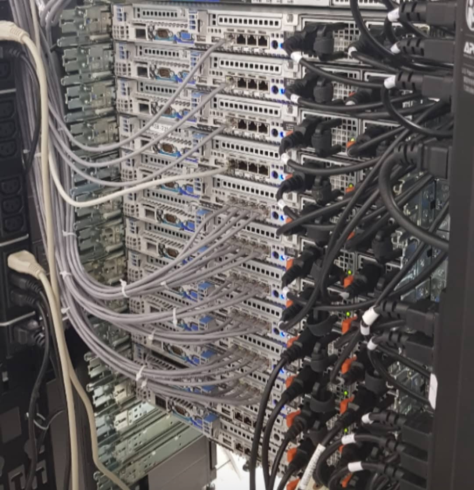
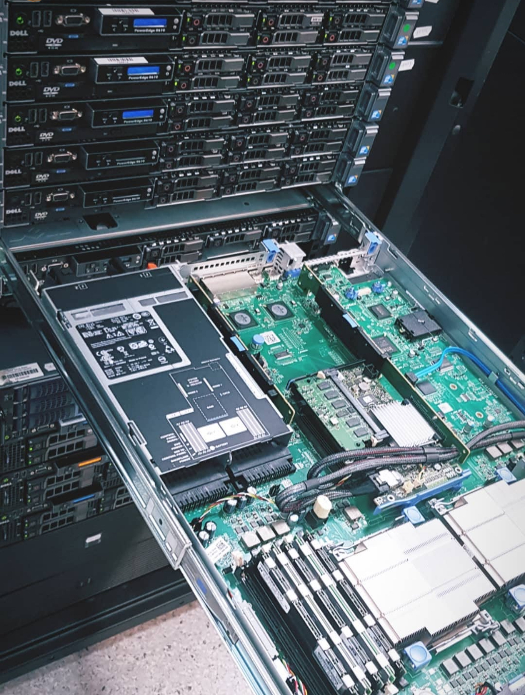
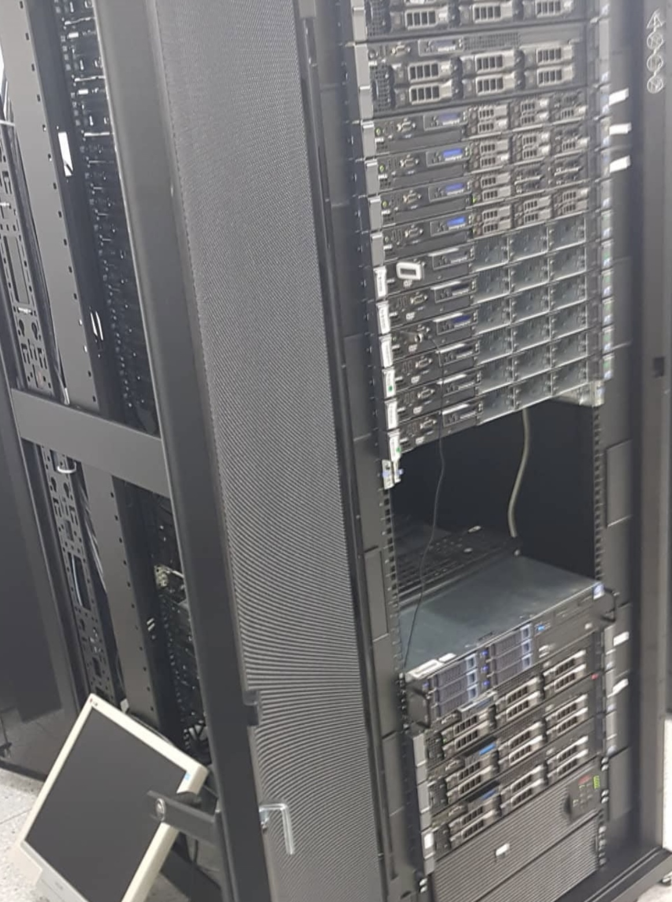
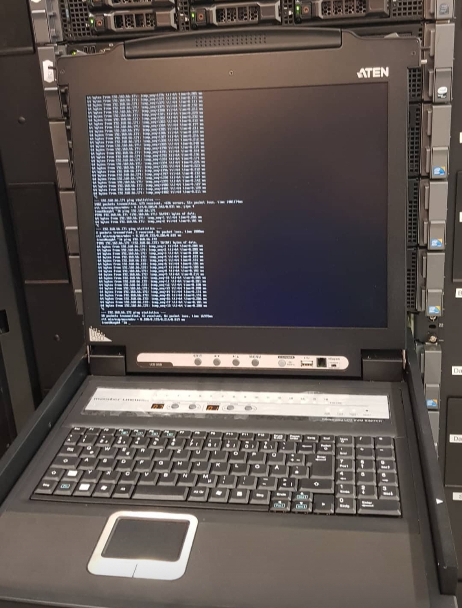
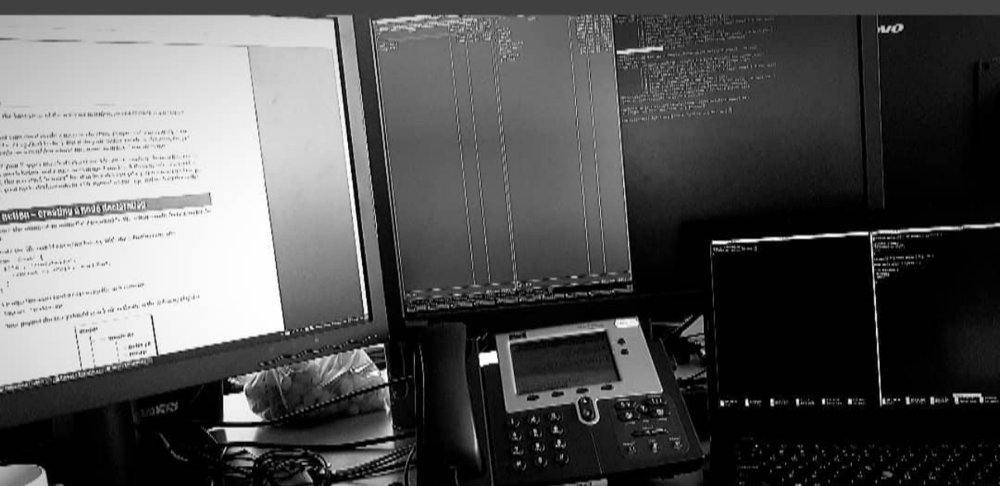

This marks the beginning of my journey into the IT industry. At that time, I was 20 years old and in my second year of a Computer Science program. I had never been particularly fond of learning or attending university classes, and I lacked the confidence to apply for jobs. However, it quickly became clear that sometimes it's important not to undervalue yourself but to be at least realistic about your knowledge.

## March 2018

It likely would have taken me a long time to muster the courage to submit my first CV, as I always felt I didn't have enough knowledge—especially since I wasn't attending classes. Yet, I had been interacting with servers and databases since I was around 11-12 years old, back in 2008-2009. This background is part of the IT journey that continues to fuel my curiosity even now, at 27, which I will delve into in a future blog post.

## The Push I Needed

> I want to take a moment to thank [@Dacian](https://github.com/daciancopo) for giving me that much-needed push to get going.
{: .prompt-tip }

Dacian, a good friend from the tech scene, practically dragged me out of bed to create my CV (I was indeed indifferent, not just underestimating my skills). My first CV was created in NOTEPAD! I even went so far as to print it out in case sending it online wasn't enough—at that time, I had no idea how job applications worked. It was the first time I had ever done something like that.

## The Opportunity

So, after some persuasion, my friend had seen an advertisement a few days earlier for a System Administrator position at a company called Netex. His excitement was contagious because, let's face it, most people in IT, at least in my town, associated the field strictly with programming. Knowing I was interested in sysadmin roles (having run an online gaming community with him back in 2012), he didn't hesitate to support me and push me into the workforce 😄.

## The Interview Process

When I arrived at the company's headquarters, I felt a bit anxious, but the process was quick. I submitted my CV and was informed that someone from HR would contact me soon for an update. After leaving, I almost completely forgot about that moment, but within a week, I received a phone call to schedule an interview.

### The Technical Interview

It had been nearly two weeks since I submitted my CV, and the day of the interview finally arrived. At the company's main office, I was invited into a conference room with an HR representative and the head of the IT department. They started by introducing the company, what they did, and what they were looking for. Then, it was my turn to express what I sought from an employer and share my experience.

> I realized I had the logic but perhaps not the appropriate tech vocabulary. Nevertheless, this logic led to a pleasant and relaxed conversation.
{: .prompt-warning }

### First IT Job Interview Questions

Here are some of the questions and how I recall responding:

*If you're a beginner, try to answer these questions before checking the solutions! 😄*

**Q: What is the administrator user in Linux?**

Show Answer

> **A:** root
{: .prompt-info }

**Q: How do you view the open ports locally on a Linux machine?**

Show Answer

> **A:** `netstat -tulpen`
{: .prompt-info }

**Q: How do you view open ports on a remote Linux machine?**

Show Answer

> **A:** `nmap`
{: .prompt-info }

**Q: What are the basic file permissions in Linux?**

Show Answer

> **A:** r - read(4), w - write(2), x - execute(1)
{: .prompt-info }

**Q: What are the ports for the following protocols? (https, ssh, imap, smtp, dns, etc.)**

Show Answer

> **A:** http - 80; https - 443; ssh - 22; I don't know the others off the top of my head, but I can find out quickly using the command: `cat /etc/services | grep -i mysql`
{: .prompt-info }

*My experience has taught me that responses like this, which are somewhat out-of-the-box, are highly appreciated as they provide interviewers with a clear perspective about you, showing that you haven't just memorized facts but truly understood the logic behind the topics.*

**Q: What is /etc/shadow?**

Show Answer

> **A:** A file that contains local users and their encrypted passwords on Linux systems, visible only to the root user.
{: .prompt-info }

## The Offer

The next day, I decided to attend a class at the university since I was in Timișoara, where I was enrolled (I was commuting from my hometown). During that time, I didn't attend classes frequently as I had become quite bored with the idea of university. I do not recommend anyone to skip out, as I believe it's a significant advantage, just not for me.

> I had barely finished my first class when I got a call from the company where I interviewed, telling me I got the job!
{: .prompt-tip }

Upon arriving at the office, I met again with HR and the department head. I accepted the offer, which I believe was slightly above the minimum wage in Romania. I was not focused on the salary aspect, as I had never approached this field with that mindset; it seemed to come naturally.

## Next Steps

From this point, my technical journey at my first job can be found here: [merox.dev/resume/](https://merox.dev/resume/). It was certainly a place where I learned a lot and even made friends; I still occasionally go out for a beer with my former department head. 😊

This concludes the first chapter of my Merox IT Journey series that I am starting on my blog. If you made it this far, I hope you found my experience at least somewhat interesting. I welcome your feedback and would love for you to share your own experiences as well!

> Stay tuned for more stories from my IT journey in future blog posts!
{: .prompt-info }

---

## Audio Version

<audio controls>
  <source src="/assets/audio/elevenlabs_first-steps-in-it-career-meroxdev.mp3" type="audio/mpeg">
  Your browser does not support the audio element.
</audio>
Narration is AI generated with <a href="https://elevenlabs.io/">ElevenLabs</a>

## Gallery

*Some nostalgic photos from that period*

 

