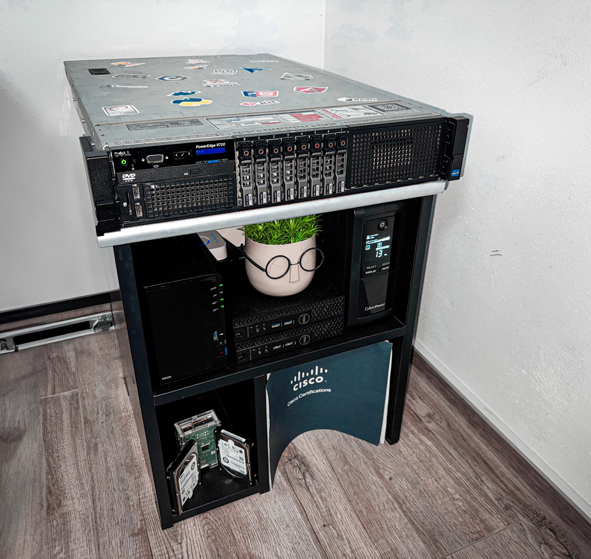
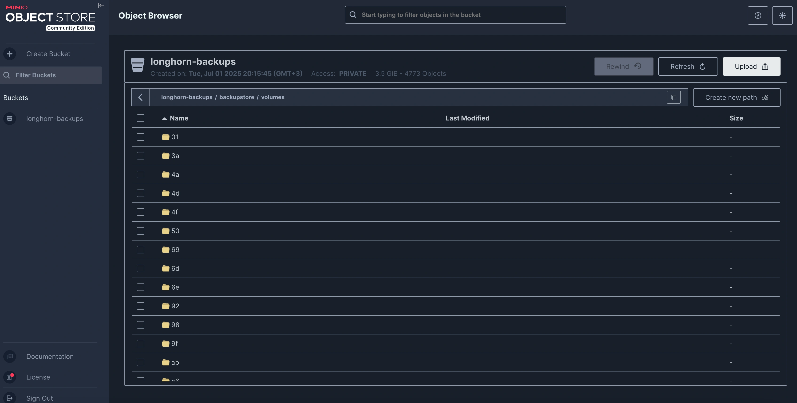

## Hardware Overview

### Power Protection

| Device | Model | Protected Equipment | Capacity |
|:-------|:------|:-------------------|:---------|
| **UPS #1** | CyberPower | Dell R720 | 1500VA |
| **UPS #2** | CyberPower | Mini PCs + Network | 1000VA |

### Network Stack

| Device | Model | Specs | Purpose |
|:-------|:------|:------|:--------|
| **ONT** | Huawei | 1GbE | ISP Gateway |
| **Firewall** | XCY X44 | 8× 1GbE | pfSense Router |
| **WiFi** | TP-Link AX3000 | WiFi 6 | Wireless AP |
| **Switch** | TP-Link | 24-port | Core Switch |

### Compute Resources

> **On-Premise Hardware**
{: .prompt-info }

| Device | CPU | RAM | Storage | Purpose |
|:-------|:----|:----|:--------|:--------|
| **Beelink GTi 13** | i9-13900H (14C/20T) | 64GB DDR5 | 2× 2TB NVMe | Proxmox |
| **OptiPlex #1** | i5-6500T (4C/4T) | 16GB DDR4 | 128GB NVMe / 2TB | Proxmox |
| **OptiPlex #2** | i5-6500T (4C/4T) | 16GB DDR4 | 128GB NVMe / 2TB | Proxmox |
| **Dell R720** | 2× E5-2697v2 (24C/48T) | 192GB ECC | 4× 960GB SSD | Backup Server |
| **Synology DS223+** | ARM RTD1619B | 2GB | 2× 2TB RAID1 | NAS/Media |

> **Cloud Infrastructure**
{: .prompt-tip }

| Provider | Instance | Specs | Location | Purpose |
|:---------|:---------|:------|:---------|:--------|
| **Hetzner** | CX22 | 4vCPU/8GB/80GB | Germany | Off-site Backup |
| **Oracle** | Ampere A1 | 4vCPU/24GB/200GB | USA | Docker Test |


## Network Architecture

### Simple but Effective Design

I've kept my network intentionally simple - no VLANs or complex routing (yet). Three dedicated physical interfaces on pfSense handle everything:

```
WAN Interface → Orange ISP (Bridge Mode)
LAN Interface → Homelab Network
WiFi Interface → Guest/IoT Isolation
```

> **Security Note:** WiFi clients are firewalled from homelab services, except whitelisted ones like Jellyfin
{: .prompt-warning }

### Network Topology

Here's how everything connects together. The key insight: Tailscale creates a flat network across all locations:


*Click to enlarge - Full network topology including Tailscale mesh connections*

> **Geo-distributed Exit Nodes:** Both VPS instances double as Tailscale exit nodes, allowing me to route traffic through EU (Hetzner) or US (Oracle) regions for geo-restricted content or better latency.

## Self-Hosted Applications and Services

### Core Infrastructure

#### pfSense

The heart of my network - a fanless mini PC from AliExpress (~200€) running pfSense for 3+ years:

👉 [XCY X44 on AliExpress](https://www.aliexpress.com/item/1005004848317962.html)


**Tailscale Subnet Router**
Exposes the entire homelab to cloud VPS without installing Tailscale on every device. Perfect solution for CGNAT (Carrier-Grade NAT) bypass - when your ISP doesn't give you a public IP address.

[Setup guide →](https://merox.dev/blog/tailscale-site-to-site/)

**Unbound DNS**
Local recursive resolver with domain overrides for `*.k8s.merox.dev` pointing to K8s-Gateway.

**Telegraf**
Pushes system metrics to Grafana for monitoring dashboards.

**Network Security**
- **WiFi → LAN**: Block all except some self-hosted apps
- **LAN → WAN**: Allow all  
- **WAN → Internal**: Block all except exposed services

#### Power Management with CyberPower UPS

Managing power for the critical infrastructure - the CyberPower 1000VA protects all mini PCs and network equipment:

**Power Management Features**

| Feature | Implementation | Purpose |
|:--------|:---------------|:--------|
| **pwrstat** | USB to GTi13 Pro | Automated shutdown orchestration |
| **SSH Scripts** | Custom automation | Graceful cluster shutdown |
| **Monitoring** | Telegram alerts | Real-time power notifications |


> **Safety First:** When power fails, the UPS triggers a cascading shutdown sequence - Kubernetes nodes drain properly before Proxmox hosts power down
{: .prompt-warning }

**Telegram Integration**

Instant notifications keep me informed of power events wherever I am:


### Storage Solutions

#### Synology DS223+ - Reliable NAS Storage

The reliable storage backbone - serving dual purposes in my infrastructure:

**Media Storage**
- **Protocol**: SMB/NFS shares (experimenting with both)
- **Purpose**: Central storage for ARR stack
- **Access**: Mounted directly in Kubernetes pods and Docker containers

**Personal Cloud**
After 3 years of self-hosting Nextcloud, I switched to Synology Drive for a more polished experience:

-  **Better performance** than my Nextcloud instance
-  **Native mobile apps** that actually work reliably
-  **Set-and-forget** reliability for family photos/documents
-  **2TB RAID1** protection for peace of mind


> **Experience Note:** Sometimes the best self-hosted solution is the one that requires the least maintenance. Synology Drive has been that for my personal files.
{: .prompt-info }

#### Dell R720: From AI Experiments to Backup Server

The power-hungry beast of the homelab - this old datacenter workhorse has served many purposes over the past year:

**Evolution of Use Cases**

| Period | Purpose | Configuration | Notes |
|:-------|:--------|:--------------|:------|
| **Phase 1** | Proxmox hypervisor | 24C/48T, 192GB RAM | Raw performance testing |
| **Phase 2** | AI Playground | Quadro P2200 GPU | Ollama + Open WebUI |
| **Current** | Backup Target | 4× 960GB RAID-Z2 | Weekly MinIO sync |

**Hardware Modifications**

The most interesting project was **flashing the RAID controller to IT mode** - completely bypassing hardware RAID for direct disk access. IT mode allows the operating system to see drives directly rather than through a RAID abstraction layer.

> **Guide:** For H710/H310 and more crossflashing instructions, check out [Fohdeesha's excellent guide](https://fohdeesha.com/docs/perc.html)
{: .prompt-tip }

**Remote Management**

iDRAC Enterprise makes this server a joy to manage remotely:


**Current Role: Off-site Backup Target**

Given the ~200W idle power consumption, I've implemented a smart scheduling system:

-  **Power Schedule**: Wake-on-LAN 1-2× weekly
-  **Sync Task**: Pull MinIO backups from Hetzner VPS
-  **Storage**: RAID-Z2 for redundancy
-  **3-2-1 Rule**: Completes my backup strategy

> **Power Efficiency Note:** Running 24/7 would cost ~€20/month in electricity.
{: .prompt-warning }

*Still constantly changing my mind about what to run here*

### Virtualization Platform

#### Proxmox - The Compute Foundation

The compute playground of my homelab - a small but mighty 3-node cluster spread across my mini PCs.


> **Philosophy Change:** I've simplified from my previous complex setup. Rather than managing dozens of VMs/containers, I now focus on quality over quantity - running only what truly adds value.
{: .prompt-info }

**Current Virtual Machines**

| VM | Purpose | Specs | Notes |
|:---|:--------|:------|:------|
| **3× Talos Kubernetes** | Kubernetes nodes | 4vCPU/16GB/1TB | Intel iGPU passthrough |
| **meroxos** | Docker host for simpler services | 4vCPU/8GB/500GB | Alternative to Kubernetes complexity |
| **Windows Server 2019** | AD Lab | 4vCPU/8GB/100GB | Active Directory experiments |
| **Windows 11** | Remote desktop | 4vCPU/8GB/50GB | Always-ready Windows machine |
| **Home Assistant** | Home automation | 2vCPU/4GB/32GB | See automation section below |
| **Kali Linux** | Security testing | 2vCPU/4GB/50GB | *To be restored from backup* |
| **GNS3** | Network lab | 4vCPU/8GB/100GB | *To be restored from backup* |

> **New to Homelabbing?** Start with the Proxmox + Docker section before diving into Kubernetes. You can run everything there first!
{: .prompt-info }

**Smart Home Integration**

While I have various IoT devices, my Home Assistant setup is intentionally minimal(for the moment). The most interesting automation? **Location-based server fan control**:

-  **Phone at home** → Dell R720 fans run quieter
-  **Away from home** → Fans ramp up for better cooling

> **Pro tip:** For Dell R720 fan control details, check out my [dedicated post](https://merox.dev/blog/dell-r720/)
{: .prompt-tip }

**Infrastructure Distribution**

Each Proxmox node runs one Talos VM, ensuring:
- High availability across physical hosts
- Balanced resource utilization  
- No single point of failure for Kubernetes

### Cloud Infrastructure

Extending beyond the homelab walls - strategic cloud deployments for resilience and global reach:


**Infrastructure Overview**

All managed through a single Portainer instance at `cloud.merox.dev`:


> **Cost Optimization:** Hetzner's CX22 at ~€4/month provides the perfect balance of resources for 24/7 operations
{: .prompt-tip }

#### cloud-de (Hetzner VPS)

The always-on sentinel watching over my homelab:

| Service | Container | Purpose |
|:--------|:----------|:--------|
| **Monitoring Stack** | Grafana, Prometheus, Alertmanager | External homelab monitoring |
| **Pi-hole** | DNS resolver | Dedicated Tailscale split-DNS |
| **Traefik** | Reverse proxy | SSL certificates for all VPS services |
| **Guacamole** | Remote access | Cloudflare Tunnel exposed |
| **Firefox** | Browser container | GUI access via Guacamole RDP |

> **Reliability First:** When the homelab is down, this VPS ensures I can still access critical services and troubleshoot remotely
{: .prompt-warning }

#### homelab-ro (Local Docker)

The emergency escape hatch - when Kubernetes complexity becomes too much:

| Service | Purpose | Note |
|:--------|:--------|:-----|
| **ARR Stack** | Media automation | Quick restore when Kubernetes fails |
| **Netboot.xyz** | PXE server | Network boot any OS/tools |
| **Portainer Agent** | Management | Remote Docker control |

*Because sometimes you just need things to work without debugging YAML manifests at 2 AM*

#### cloud-usa (Oracle Free Tier)

The wildcard instance leveraging Oracle's generous free tier:

- **Testing ground** for experimental Docker images
- **Tailscale exit node** for US geo-location
- **Not in Portainer** - hit the 5-node limit (3× Kubernetes + 2× Docker)

> **Free Tier Limits:** Portainer BE restricts to 5 nodes. Priority given to production workloads over test instances.
{: .prompt-info }

> **Architecture Note:** Each cloud instance serves as a Tailscale subnet router, creating a global mesh network with automatic failover capabilities
{: .prompt-tip }

### Container Orchestration

#### Talos & Kubernetes - Enterprise-Grade at Home

*Fair warning: This is where I went full "because I can" mode. If you just want to run services, stick with Docker. But if you want to learn enterprise-grade container orchestration...*

**The Journey to Over-Engineering**

After diving deeper into Kubernetes automation, I discovered this magic: 
 [onedr0p/cluster-template](https://github.com/onedr0p/cluster-template)

> **Game Changer:** Talos OS - my first experience with a declarative, immutable operating system. After a few days of troubleshooting and research, I was completely sold on this approach.
{: .prompt-info }

> **Why Talos over K3s?**
> - Immutable OS = less maintenance
> - GitOps-first design
> - Declarative everything
> - Perfect for learning "real" Kubernetes
{: .prompt-tip }

**My Infrastructure Repository**

Fork and customize: 👉 [github.com/meroxdotdev/infrastructure](https://github.com/meroxdotdev/infrastructure)

**Key Customizations**

| Component | Modification | Reason |
|:----------|:-------------|:-------|
| **Storage** | Longhorn CSI | Simpler PV/PVC management |
| **Talos Patches** | [Custom machine config](https://github.com/meroxdotdev/infrastructure/blob/main/talos/patches/global/machine-longhorn.yaml) | Longhorn requirements |
| **Custom Image** | [factory.talos.dev/installer/8d37fcc...](https://factory.talos.dev/image/8d37fcc01bb9173406853e7fd97ad9eda40732043f88e09dafe55e53fcf4b510/v1.10.4/metal-amd64.iso) | Intel iGPU + iSCSI support |

> **Custom Talos Image includes:**
> - Linux driver tools
> - iSCSI-tools (for network storage)
> - Intel iGPU drivers for Proxmox passthrough
{: .prompt-tip }

**GitOps Structure**

```
infrastructure/kubernetes/apps/
├── storage/          # Longhorn configuration
├── observability/    # Prometheus, Grafana, Loki (WIP)
└── default/          # Production workloads
```

**Cluster Management with Lens**

For day-to-day Kubernetes management, I use Lens - it provides a beautiful overview of the entire cluster health, resource usage, and running workloads:


**Deployed Applications**

| App | Purpose | Special Notes |
|:----|:--------|:--------------|
| **Radarr** | Movie automation | NFS to Synology |
| **Sonarr** | TV automation | NFS to Synology |
| **Prowlarr** | Indexer manager | Central search |
| **qBittorrent** | Torrent client | ⚠️ Use v5.0.4 for GUI config |
| **Jellyseer** | Request management | Public via Cloudflare |
| **Jellyfin** | Media server | Intel QuickSync enabled |
| **Homepage** | Dashboard | Still organizing... |


**Homepage Dashboard**

My centralized view of everything (work in progress on the organization):


**Automation Benefits**

With this setup, I can completely rebuild my cluster in **8-9 minutes**:

-  **Clean**: Declarative configuration for everything
-  **Organized**: GitOps workflow with Flux
-  **Sustainable**: Renovate bot keeps dependencies updated
-  **Reproducible**: All configs in Git

> **Security Reminder:** Keep your SOPS keys and secrets backed up separately - you'll need them to decrypt your repository when rebuilding from scratch!
{: .prompt-warning }

## Backup Strategy

Daily automated backups ensure data persistence:

- **Longhorn PVCs** → Daily backup to MinIO on R720
- **MinIO on R720** → Weekly sync to Hetzner Storagebox
- **Result**: Complete 3-2-1 backup strategy



*For detailed deployment instructions, check out the excellent [onedr0p/cluster-template README](https://github.com/onedr0p/cluster-template) - it's surprisingly straightforward to follow.*

## What's Next

All these being said, this is my homelab and I hope you really enjoyed it or it helped you in any way. If you have any questions don't hesitate to write down a comment to ask me, I'll be happy to help :)