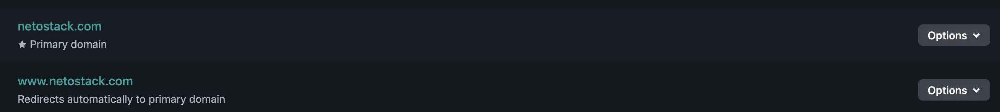

## Why I Needed Better Networking Tools

As a system administrator, I regularly face the challenge of efficiently calculating subnets, CIDR ranges, IP conversions, and DNS configurations. Whether it's planning VLANs, validating IP addresses, generating PTR records, or troubleshooting with diagnostics like DNS lookups and TCP port checks, these tasks can eat up valuable time without the right tools.

From subnetting with VLSM calculators to CIDR operations like summarization and splitting, or even advanced DNS utilities such as SPF policy builders and DMARC checkers – having everything in one place makes a huge difference. Add in reference materials on IPv6 addressing, reserved IP ranges, and common ports, and you've got a complete toolkit for network engineers and sysadmins.

This ongoing need pushed me to search for a comprehensive tool that could streamline these processes without wasting extra time.

## Discovering the Perfect Open-Source Solution

After researching on GitHub for a few days, I stumbled upon Alicia Sykes' excellent project: [networking-toolbox](https://github.com/Lissy93/networking-toolbox). It was exactly what I needed – a powerful, offline-capable suite of networking utilities covering everything from IP calculators and CIDR tools to DNS generators and diagnostics.

Excited, I quickly forked the repository to customize it for my needs.

*My forked NetoStack repository on GitHub*

## Rapid Deployment with GitHub and Netlify

To make it accessible, I registered a new domain via Cloudflare: `netostack.com`. Then, I connected my GitHub account to Netlify, authorized the forked repository, and set up automatic deployments.

*Setting up the domain on Netlify*

The entire process – from forking the repo to going live – took less than 10 minutes. Netlify's seamless integration with GitHub handles builds and deploys automatically, making it incredibly fast to launch open-source projects like this.

*Netlify deployment in progress*

Now, the site is live at [netostack.com](https://netostack.com), ready to help me and anyone else with networking tasks. It works offline too, right from your browser, thanks to its progressive web app design.

*NetoStack.com live preview*

## Key Features of NetoStack

NetoStack serves as your offline network command center, packed with essential tools:

- **Subnetting Tools:** IPv4/IPv6 calculators, VLSM, supernet aggregator, subnet planner
- **CIDR Utilities:** Mask conversions, summarizer, splitter, allocator, and more
- **IP Tools:** Format converters, distance calculator, regex generator, IPv6 expand/compress
- **DNS Generators:** PTR, reverse zones, SPF/DMARC builders, record validators
- **Diagnostics:** DNS lookups, HTTP analyzers, TLS probes, port checkers
- **Reference:** CIDR explanations, IPv6 types, reserved ranges, common ports

All these features are available even without internet, making it perfect for field work or air-gapped environments.

> **Pro Tip:** Bookmark your favorites like the IPv4 Subnet Calculator or DNS Propagation Checker for quick access.
{: .prompt-tip }

## Final Thoughts

If you're a sysadmin or network engineer tired of juggling multiple tools, give NetoStack a try. Deploying open-source projects like this via GitHub and Netlify is lightning-fast – proof that you can have a production-ready site up in minutes.

A big thank you to [Alicia Sykes](https://github.com/Lissy93) for sharing these amazing open-source projects under the MIT license. It's contributions like hers that make the community thrive.

Happy networking, everyone! If you have questions or suggestions, drop a comment below – I'd love to hear from you.
