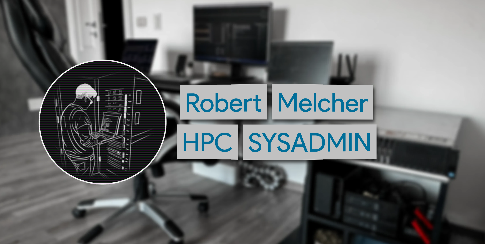

<!---->

## Hello, World 👋

**I’m merox** = **ME**lcher **RO**bert + **X** (evolved from mer0x39, where 0x39 is my birthday in hex)  

HPC Sysadmin | Homelab Enthusiast | Cognitive Science Explorer

### Current Focus

Expanding expertise in modern infrastructure:
- Kubernetes orchestration & container management
- DevOps practices & automation pipelines
- Cloud-native technologies & GitOps

### Experience

**Key Projects**:
- Migrated Puppet infrastructure from VM to Kubernetes
- Led enterprise-wide Forescout policy migration
- Designed datacenter backup solution with Bareos
- Implemented security across Palo Alto, Fortigate, Cisco

---

Download [my resume](https://merox.dev/robert-melcher-cv.pdf)

> Open to collaboration and new opportunities in DevOps and cloud infrastructure. Let's build something amazing together!
{: .prompt-info }